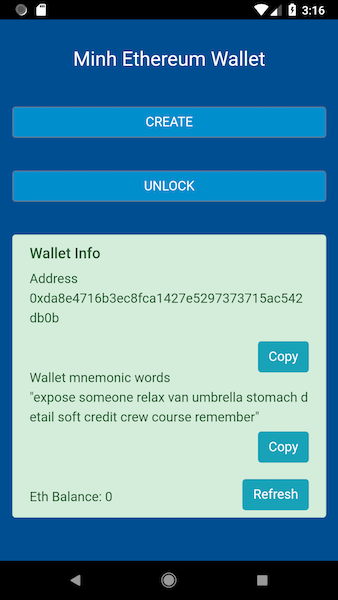

# Minh LightWallet.
**The mobile Ethereum wallet application demo**

## App Concept
The Ethereum Wallet which supports Ether and its tokens.

This wallet follows the light network concept and allows the users to manage wallet accounts with keystore, generate address, unlock accounts, transfer ether as well as token based on Ethereum token standard.   

  

## Platform and Dependency
- ReactJS
- Cordova
- ConsenSys/eth-lightwallet
- Webpack
- web3
- crypto

## Running
This project can run on Web, Android and iOS platform.

Please pull the project then run `npm install`.

### Android
**The NodeJS ConsenSys/eth-lightwallet library is not supported below Android 7.0**

Install Cordova `npm install -g cordova`

Build the project `npm run build`

Add Cordova platform `cordova platform add android`

When the Cordova deployment is done, there  would be an Android folder. It could be built with Android Studio.

To run on Android emulator directly, please turn on emulator then execute `cordova run android`. However, please configure Android environment first. Take a look at [this](https://cordova.apache.org/docs/en/latest/guide/platforms/android/).

The execution still use webpack in mobile deployment.

### iOS
**The NodeJS ConsenSys/eth-lightwallet library is not supported below iOS 9**

Install Cordova `npm install -g cordova`

Build the project `npm run build`

Add Cordova platform `cordova platform add ios`

Please install Xcode. Take a look at [this](https://cordova.apache.org/docs/en/latest/guide/platforms/ios/).

When the Cordova deployment is done, there  would be an ios folder. It could be built with Xcode.

To run on iOS directly, please turn on emulator then execute `cordova run ios`.

### Web
Go with `npm start`.

The web app will run at http://localhost:7000.

This port could be replaced in webpack configuration.

## Usage
To create a wallet which is also known as a keystore, there are 2 elements which are required in Ethereum blockchain. The passphrase and mnemonic keys. Need these elements to unlock the wallet too.

The Ethereum network in this application is Rinkeby and Main Network. The configuration could be replaced in `util/Settings.js`.
